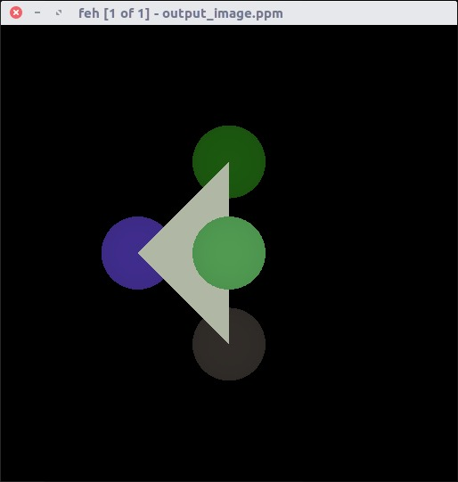
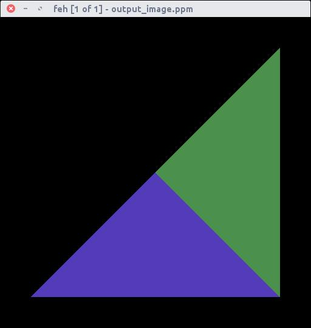

# RT-Template: Intersecção Raio-Triângulo

Este arquivo usa o RT-Template disponibilizado pelo professor Christian A. Pagot, que pode ser encontrado [clicando aqui](https://github.com/capagot).

## Atividade Proposta

Criar um código responsável para a primitiva triângulo, visto que o template suporta apenas esferas.

## Como Foi Feito

Utilizei o método "Möller-Trumbore algorithm", onde o mesmo é um método rápido para calcular a interseção de um raio e um triângulo em três dimensões sem necessidade de pré-computação da equação do plano que contém o triângulo. assim, ele pode ser usado em computação gráfica para implementar cálculos de rastreamento de raios envolvendo malhas triangulares.

## Algoritmo

```cpp
bool RayIntersectsTriangle(Vector3D rayOrigin, 
                           Vector3D rayVector, 
                           Triangle* inTriangle,
                           Vector3D& outIntersectionPoint)
{
    const float EPSILON = 0.0000001; 
    Vector3D vertex0 = inTriangle->vertex0;
    Vector3D vertex1 = inTriangle->vertex1;  
    Vector3D vertex2 = inTriangle->vertex2;
    Vector3D edge1, edge2, h, s, q;
    float a,f,u,v;
    edge1 = vertex1 - vertex0;
    edge2 = vertex2 - vertex0;
    h = rayVector.crossProduct(edge2);
    a = edge1.dotProduct(h);
    if (a > -EPSILON && a < EPSILON)
        return false;
    f = 1/a;
    s = rayOrigin - vertex0;
    u = f * (s.dotProduct(h));
    if (u < 0.0 || u > 1.0)
        return false;
    q = s.crossProduct(edge1);
    v = f * rayVector.dotProduct(q);
    if (v < 0.0 || u + v > 1.0)
        return false;
    // At this stage we can compute t to find out where the intersection point is on the line.
    float t = f * edge2.dotProduct(q);
    if (t > EPSILON) // ray intersection
    {
        outIntersectionPoint = rayOrigin + rayVector * t; 
        return true;
    }
    else // This means that there is a line intersection but not a ray intersection.
        return false;
}
``` 

Nesse algoritmo só tive que fazer algumas mudanças nos parametros, visto que o raio já continha os dados necessários. Maiores informações, pode-se olhar o código em triangle.cpp, lá possui comentários explicando melhor.

## Cores

Decidi tentar adicionar cores logo nessa atividade, como um "extra". Para isso, adicionei no código da primitiva a cor, assim, assume-se que cada primitiva possua uma cor. Para escolher a cor, usei um método randômico onde setava o RGB.
Para mostrar a cor, apenas modifiquei a linha onde setava o buffer_.buffer_data_[x][y] (Sinceramente, coloquei um cálculo que me foi indicado, mas modificando o cálculo, não senti tanta diferença assim, a maior diferença que percebia era só quando se afastava ao longo do eixo z)

## Imagens

Gerei uma imagem com o triângulo mantendo as esferas, para saber se as vértices estavam corretas:
<p align="center">
	<br>
	
	<h5 align="center">Figura 1 - Triângulo gerado junto com as esferas</h5>
	<br>
</p>

Removendo as esferas e adicionais mais triângulos:
<p align="center">
	<br>
	
	<h5 align="center">Figura 2 - Triângulos em vários formatos</h5>
	<br>
</p>


## Dificuldades Encontradas

Não houve nada que pudesse ser encarado como dificuldade, as partes mais trabalhosas foram apenas pensar em como fazer sobre as cores, como onde inserir o código para manter uma boa estrutura.
Além do mais, "visualizar" os triângulos na tela antes de inserir é meio que uma dificuldade pra mim, porém, deixei dessa forma na base de tentativa e erro.


## Fontes

[Ray Tracing: Rendering a Triangle -Scratch a Pixel 2.0](https://www.scratchapixel.com/lessons/3d-basic-rendering/ray-tracing-rendering-a-triangle/moller-trumbore-ray-triangle-intersection)

[Möller–Trumbore Intersection Algorithm - Wikipédia](https://en.wikipedia.org/wiki/M%C3%B6ller%E2%80%93Trumbore_intersection_algorithm)

