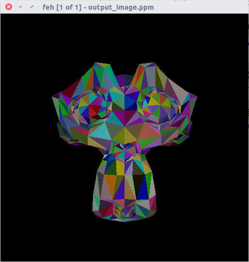
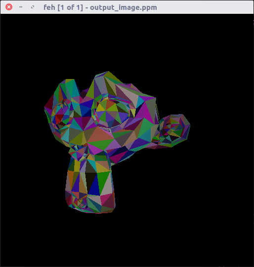

# RT-Template: Câmera Perspectiva

Este arquivo usa o RT-Template disponibilizado pelo professor Christian A. Pagot, que pode ser encontrado [clicando aqui](https://github.com/capagot).

## Atividade Proposta

- Adiconar câmera perspectiva
- Ler um arquivo .obj e criar os triângulos

## Resultados

	 
	
	<h5 align="center">Figura 1 - Leitura do obj funcionando corretamente, junto com a câmera perspectiva</h5>
	 

	 
	
	<h5 align="center">Figura 2 - Mudança de posição da câmera, provando a noção de distância que a câmera perpectiva promove</h5>
	 

