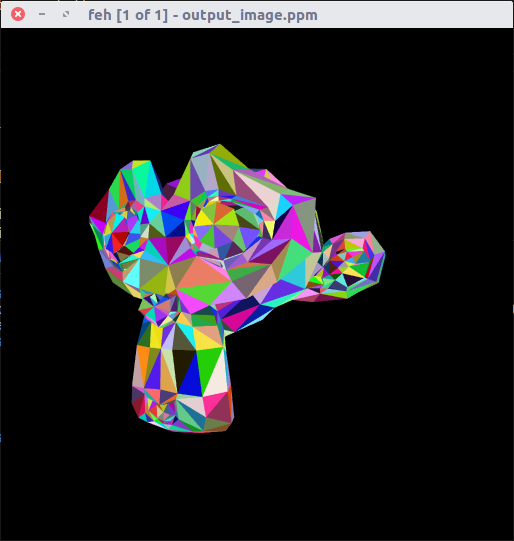
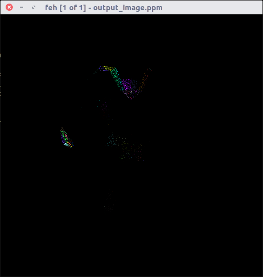

# RT-Template: Path Tracer

Este arquivo usa o RT-Template disponibilizado pelo professor Christian A. Pagot, que pode ser encontrado [clicando aqui](https://github.com/capagot).

## Como usar o programa

```sh
$ ./swpathtracer Samples_Per_Pixel Depth Threads OutputFile
```

- Samples_Per_Pixel: Quantidade amostras por pixel

- Depth: Profundidade máxima dos raios

- Threads: Quantidade de threads usada para gerar a imagem (usei 4, devido minha máquina ser um i5)

- OutputFile: Nome de saída do arquivo, não é necessário inserir a extensão, será sempre um arquivo do tipo .ppm

## Atividade Proposta

- Box filtering: Diversas amostras de radiância serão obtidas para cada pixel. As amostras devem apresentar distribuição uniforme sobre a área do pixel (sugestão: utilizar as classes de geração de números randômicos para C++11, mais especificamente o Mersenne Twister). O resultado final da radiância incidente em um pixel será a média das amostras (box filter). O número de amostras por pixel deve ser um parâmetro da aplicação.

- Profundidade máxima dos raios: Resultados satisfatórios podem ser obtidos com raios de profundidade 5. Entretanto, a profundidade máxima dos raios deve ser um parâmetro da aplicação.

- Materiais: Os objetos da cena podem ser perfeitamente difusos e/ou emissores. Os materiais difusos devem ser representados por meio de uma BRDF (sugere-se a criação de uma classe específica para BRDFs), que será uma propriedade das primitivas. A emitância também será uma propriedade adicional das primitivas.

- Amostragem: a amostragem a ser utilizada na determinação dos raios incidentes nos pontos de intersecção dos raios deverá ser uniforme (como visto em aula).

## Resultados

Nos primeiros commits dessa atividades, já deu pra notar uma grande diferença entre o ray tracing e o path tracing, antes mesmo de usar a emitância, como pode-se ver na comparação de images a seguir:


<p align="center">
	<br>
     
	<h5 align="center">Figura 1 - A esquerda, início do path tracer, na direita, imagem utilizando ray tracer</h5>
	<br>
</p>

Após isso, foi criado a emitância, ou seja, definindo ou não se certa "parte" será quem emite luz ou não, e usando uma pequena fonte de luz, o resultado foi o seguinte:

<p align="center">
	<br>
	
	<h5 align="center">Figura 2 - Começando a usar emitância</h5>
	<br>
</p>

A qualidade da imagem não fica muito boa, pois os raios que não encontram o modelo, não são rebatidos de lugar algum, e os que encontram, não rebatem em nada, assim, ficando com essa qualidade.